# EU App Backend API

> A full-featured fitness, nutrition, and rehabilitation backend built with FastAPI and Supabase.

---

## Table of Contents

- [Overview](#overview)
- [Tech Stack](#tech-stack)
- [Project Structure](#project-structure)
- [Getting Started](#getting-started)
- [Authentication](#authentication)
- [Database Architecture](#database-architecture)
- [API Modules](#api-modules)
  - [Auth & Users](#1-auth--users--auth)
  - [Exercises](#2-exercises--exercises)
  - [Workouts](#3-workouts--workouts)
  - [Meals](#4-meals--meals)
  - [Meal Plans](#5-meal-plans--meal-plans)
  - [Meal Tracking & Nutrition](#6-meal-tracking--nutrition--trackermealss--nutrition)
  - [Workout Tracking](#7-workout-tracking--trackerworkouts)
  - [Enrollment](#8-enrollment--enrollment)
  - [Daily Logs](#9-daily-logs--trackerdaily)
  - [Rehab](#10-rehab--rehab)
  - [Rehab Tracking](#11-rehab-tracking--trackerrehab)
- [Cross-Cutting Concerns](#cross-cutting-concerns)
- [Design Principles](#design-principles)

---

## Overview

The EU App Backend is a REST API that powers a mobile/web fitness and wellness application. It supports three primary user journeys:

- **Fitness** — Workout plans, exercise tracking, and progress analytics
- **Nutrition** — Meal library, meal plans, meal scheduling, and macro tracking
- **Rehabilitation** — Rehab conditions, rehab plans, session tracking, pain monitoring, and recovery analytics

**Version:** 1.0.0  
**Framework:** FastAPI (Python)  
**Entry Point:** `main.py`  
**Run Command:** `uvicorn main:app --reload`

Interactive API documentation is auto-generated by FastAPI:
- Swagger UI → `GET /docs`
- ReDoc → `GET /redoc`

---

## Tech Stack

| Dependency | Role |
|---|---|
| `fastapi` | API framework (async-capable, OpenAPI auto-docs) |
| `uvicorn` | ASGI server |
| `sqlalchemy` | ORM / query layer over Supabase PostgreSQL |
| `supabase` | Official Supabase Python client (used for Auth only) |
| `pydantic` v2 | Data validation and serialization |
| `psycopg2` | PostgreSQL driver for SQLAlchemy |
| `python-dotenv` | Environment variable loading from `.env` |
| `slowapi` | In-process rate limiting middleware (no Redis required) |

---

## Project Structure

```
Eu-App-Backend/
├── main.py                   # App factory, router registration, CORS, rate-limit wiring
├── requirements.txt
├── .env                      # Secrets (not committed)
│
├── core/                     # Shared infrastructure
│   ├── auth.py               # JWT validation dependency, admin guard
│   ├── config.py             # App configuration helpers
│   ├── exceptions.py         # Custom HTTP exception helpers
│   ├── limiter.py            # Shared slowapi Limiter instance
│   └── security.py           # Password hashing / token utilities
│
├── db/
│   ├── database.py           # SQLAlchemy engine, session factory, Supabase client
│   └── schema.sql            # Full PostgreSQL schema (Supabase migrations source)
│
├── worker/
│   ├── celery_app.py         # Celery app configuration (async task queue)
│   └── tasks.py              # Background task definitions
│
└── modules/                  # Feature modules (one per domain)
    ├── users/
    ├── exercises/
    ├── workouts/
    ├── meals/
    ├── meal_plans/
    ├── meal_tracking/
    ├── workout_tracking/
    ├── enrollment/
    ├── daily_logs/
    ├── rehab/
    ├── rehab_tracking/
    └── schedule/             # Stub — future scheduling features
```

Every module follows a consistent **5-layer architecture**:

```
router.py      →  FastAPI APIRouter (HTTP layer, auth deps, rate limits)
service.py     →  Business logic orchestration
repository.py  →  Database queries (SQLAlchemy sessions)
models.py      →  SQLAlchemy ORM table definitions
schemas.py     →  Pydantic request/response models
```

---

## Getting Started

### Prerequisites

- Python 3.10+
- A Supabase project with the schema from `db/schema.sql` applied

### Installation

```bash
git clone <repo-url>
cd Eu-App-Backend
pip install -r requirements.txt
```

### Environment Variables

Create a `.env` file in the project root:

```env
DB_URL=postgresql://...          # PostgreSQL connection string (for SQLAlchemy)
SUPABASE_URL=https://...         # Supabase project URL
PUBLIC_ANON_KEY=...              # Supabase anonymous/public API key
```

### Run

```bash
uvicorn main:app --reload
```

---

## Authentication

The API uses **Supabase Auth** with JWT Bearer tokens.

```
HTTP Request
    └──> HTTPBearer()
            └──> get_current_user()       # Validates JWT via Supabase
                    └──> [require_admin()]  # Optional: checks role == 'admin' in DB
                            └──> endpoint handler
```

All protected endpoints require:

```http
Authorization: Bearer <access_token>
```

**Role system:**
- `user` — standard authenticated user (default)
- `admin` — elevated privileges for library management; manually assigned, not registerable

**Token management:**

| Endpoint | Description |
|---|---|
| `POST /auth/register` | Returns a JWT access + refresh token pair |
| `POST /auth/login` | Accepts email **or** username + password |
| `POST /auth/refresh` | Rotates the refresh token; old one is invalidated |
| `POST /auth/logout` | Invalidates the session server-side |

---

## Database Architecture

Tables are organized into PostgreSQL **schema namespaces**:

| Schema | Purpose |
|---|---|
| `auth` | Supabase-managed native user table (not touched by app) |
| `profile` | App extension of `auth.users` — user data and health profiles |
| `library` | Read-mostly reference data managed by admins |
| `plans` | User and admin-created workout, meal, and rehab plans |
| `tracker` | High-write live tracking data — sessions, logs, schedules |
| `public` | Stored procedures for analytics aggregations |

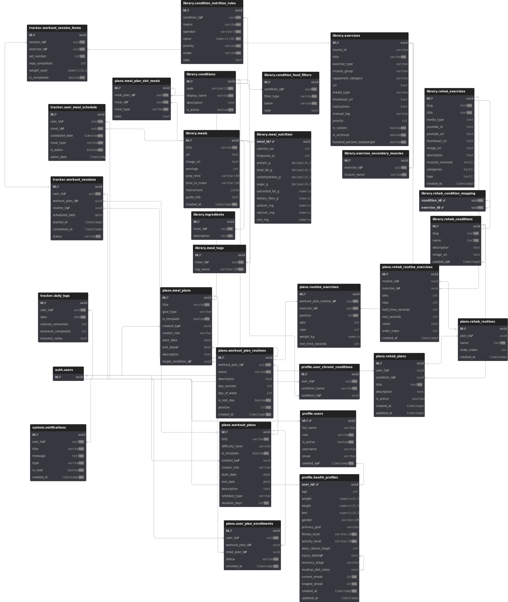

**Key design decisions:**

- `auth.users` is fully Supabase-managed. `profile.users` mirrors its UUID primary key.
- BMI is computed by a **DB trigger** on `profile.health_profiles` — never inserted by the app.
- **Forward-only state machines** are enforced on all tracker tables at the application layer.
- **Completed/terminal records are permanent** — delete attempts return `409 Conflict`.
- Complex analytics (streaks, nutrition stats, session details) are offloaded to **PostgreSQL stored procedures**.

---

## API Modules

### 1. Auth & Users — `/auth`

Manages user registration, login, token lifecycle, health profiles, and admin user listing.

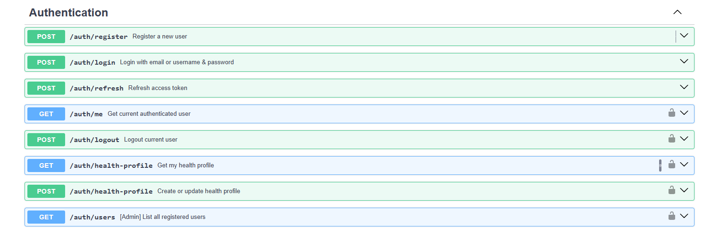

| Method | Endpoint | Auth | Rate Limit | Description |
|---|---|---|---|---|
| `POST` | `/auth/register` | — | 5/min | Register new user, returns JWT pair |
| `POST` | `/auth/login` | — | 10/min | Login with email OR username + password |
| `POST` | `/auth/refresh` | — | 5/min | Exchange refresh token for new pair |
| `GET` | `/auth/me` | ✅ | — | Returns current user info |
| `POST` | `/auth/logout` | ✅ | — | Invalidates session server-side |
| `POST` | `/auth/health-profile` | ✅ | 20/min | Create or update health profile |
| `GET` | `/auth/health-profile` | ✅ | 30/min | Get current user's health profile |
| `GET` | `/auth/users` | 🔑 Admin | — | List all registered users |

**Health Profile fields:** age, weight (kg), height (cm), gender, primary goal, fitness level, activity level, daily calorie target, injury details, recovery stage, medical diet notes. BMI is computed automatically by a database trigger.

---

### 2. Exercises — `/exercises`

Admin-managed exercise library. Users can browse and filter; admins create, update, and delete.

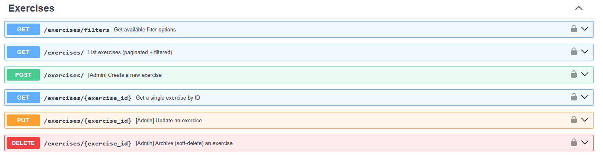

| Method | Endpoint | Auth | Description |
|---|---|---|---|
| `GET` | `/exercises/` | ✅ | List all exercises (filterable) |
| `GET` | `/exercises/{id}` | ✅ | Get single exercise detail |
| `POST` | `/exercises/` | 🔑 Admin | Create new exercise |
| `PUT` | `/exercises/{id}` | 🔑 Admin | Full update exercise |
| `DELETE` | `/exercises/{id}` | 🔑 Admin | Delete exercise |

**Available filters on `GET /exercises/`:** `muscle_group`, `equipment_category`, `difficulty_level`, `exercise_type`, `search` (by title)

---

### 3. Workouts — `/workouts`

Workout plan and routine management. Users can create personal plans; admins create shareable templates. Plans contain routines, routines contain exercises.

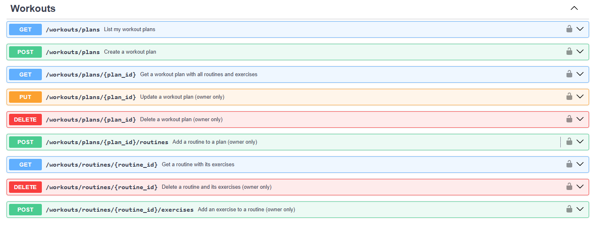

**Data hierarchy:**
```
WorkoutPlan
  └── WorkoutRoutine (day-specific, ordered)
        └── WorkoutRoutineExercise (sets, reps, rest, notes)
```

| Method | Endpoint | Auth | Description |
|---|---|---|---|
| `GET` | `/workouts/plans/` | ✅ | List own + template plans |
| `POST` | `/workouts/plans/` | ✅ | Create personal workout plan |
| `GET` | `/workouts/plans/{id}` | ✅ | Get full plan with routines and exercises |
| `PATCH` | `/workouts/plans/{id}` | ✅ | Update plan (owner only) |
| `DELETE` | `/workouts/plans/{id}` | ✅ | Delete plan (owner only) |
| `POST` | `/workouts/plans/{id}/routines` | ✅ | Add routine to plan |
| `PATCH` | `/workouts/routines/{id}` | ✅ | Update routine |
| `DELETE` | `/workouts/routines/{id}` | ✅ | Delete routine |
| `POST` | `/workouts/routines/{id}/exercises` | ✅ | Add exercise to routine |
| `DELETE` | `/workouts/routines/exercises/{id}` | ✅ | Remove exercise from routine |

---

### 4. Meals — `/meals`

Admin-managed meal library with full nutrition data. Users browse meals to add to plans or schedules.


| Method | Endpoint | Auth | Description |
|---|---|---|---|
| `GET` | `/meals/` | ✅ | List meals (filterable by tag/search) |
| `GET` | `/meals/{id}` | ✅ | Get meal detail with full nutrition |
| `POST` | `/meals/` | 🔑 Admin | Create meal with nutrition + tags + ingredients |
| `PUT` | `/meals/{id}` | 🔑 Admin | Full update meal |
| `DELETE` | `/meals/{id}` | 🔑 Admin | Delete meal |
| `GET` | `/meals/conditions/` | ✅ | List medical/dietary conditions |
| `POST` | `/meals/conditions/` | 🔑 Admin | Create condition |
| `GET` | `/meals/conditions/{id}` | ✅ | Get condition with nutrition rules and food filters |

**Meal nutrition data includes:** calories, kilojoules, protein, total fat, carbohydrates, sugar, saturated fat, dietary fibre, sodium, calcium, iron.

---

### 5. Meal Plans — `/meal-plans`

Create and manage meal plans. Admins create templates; users create personal plans. Meals are assigned to typed slots (breakfast / lunch / dinner / snack).

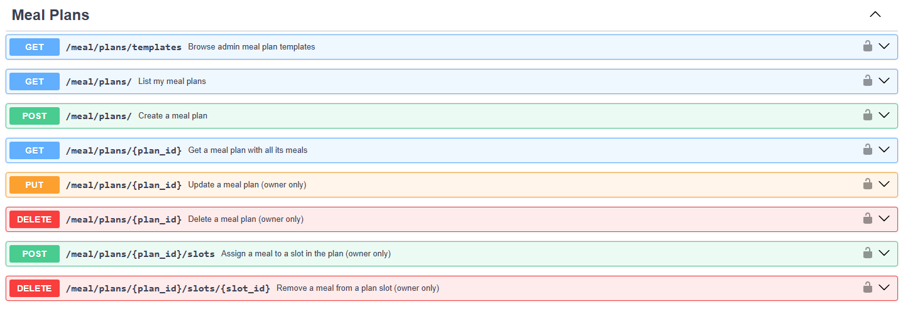

| Method | Endpoint | Auth | Description |
|---|---|---|---|
| `GET` | `/meal-plans/` | ✅ | List own + template plans |
| `POST` | `/meal-plans/` | ✅ | Create personal meal plan |
| `GET` | `/meal-plans/{id}` | ✅ | Get plan with all slots |
| `PATCH` | `/meal-plans/{id}` | ✅ | Update plan (owner only) |
| `DELETE` | `/meal-plans/{id}` | ✅ | Delete plan (owner only) |
| `POST` | `/meal-plans/{id}/slots` | ✅ | Add meal to a slot |
| `DELETE` | `/meal-plans/{id}/slots/{slot_id}` | ✅ | Remove meal from slot |
| `GET` | `/meal-plans/templates/` | ✅ | List admin template plans |

**Goal types:** `weight_loss` \| `muscle_gain` \| `rehab` \| `general`

---

### 6. Meal Tracking & Nutrition — `/tracker/meals`, `/nutrition`

Schedule meals on specific dates and times, track eaten status, and query nutrition aggregates via stored procedures.

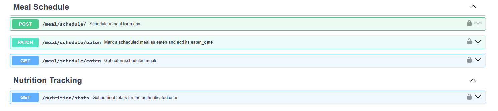

| Method | Endpoint | Auth | Rate Limit | Description |
|---|---|---|---|---|
| `POST` | `/tracker/meals/` | ✅ | 20/min | Schedule a meal |
| `GET` | `/tracker/meals/` | ✅ | 30/min | List scheduled meals (date filter) |
| `GET` | `/tracker/meals/{id}` | ✅ | 30/min | Get single scheduled meal |
| `PATCH` | `/tracker/meals/eaten` | ✅ | 20/min | Mark meal as eaten / not-eaten |
| `DELETE` | `/tracker/meals/{id}` | ✅ | 10/min | Remove from schedule |
| `GET` | `/nutrition/stats` | ✅ | 30/min | Aggregated nutrition stats for a date range |

**Nutrition Stats** (`GET /nutrition/stats`) query params:

| Param | Description |
|---|---|
| `start_date` | Start of date window |
| `end_date` | End of date window |
| `nutrient` | `all` \| `protein` \| `calories` \| `carbs` \| `fat` \| `sodium` |

Returns aggregated totals via the `public.get_user_nutrition_stats` stored procedure. When a specific nutrient is requested, all other fields are masked.

---

### 7. Workout Tracking — `/tracker/workouts`

Real-time workout session logging. Users create sessions tied to a workout plan/routine, then log individual sets per exercise.

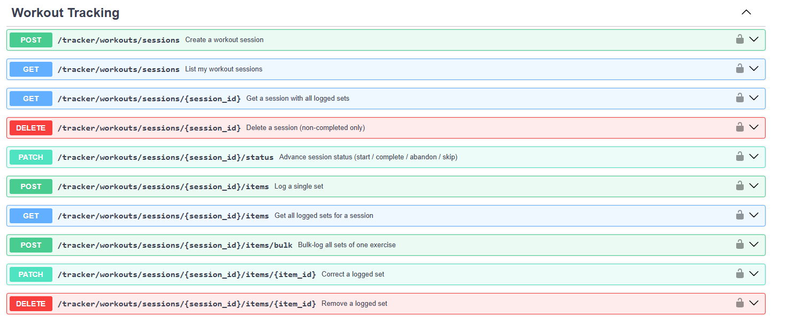

**Session status lifecycle (forward-only):**
```
scheduled → in_progress → completed  (terminal)
                        → abandoned  (terminal)
         → skipped                   (terminal)
```

| Method | Endpoint | Auth | Rate Limit | Description |
|---|---|---|---|---|
| `POST` | `/tracker/workouts/sessions/` | ✅ | 20/min | Create session |
| `GET` | `/tracker/workouts/sessions/` | ✅ | 30/min | List sessions (status/date filter) |
| `GET` | `/tracker/workouts/sessions/{id}` | ✅ | 30/min | Get full session with logged sets |
| `PATCH` | `/tracker/workouts/sessions/{id}/status` | ✅ | 20/min | Advance session status |
| `DELETE` | `/tracker/workouts/sessions/{id}` | ✅ | 10/min | Delete non-completed session |
| `POST` | `/tracker/workouts/sessions/{id}/items` | ✅ | 30/min | Log a single set |
| `POST` | `/tracker/workouts/sessions/{id}/items/bulk` | ✅ | 30/min | Bulk log all sets for one exercise |
| `GET` | `/tracker/workouts/sessions/{id}/items` | ✅ | 30/min | Get all logged sets |
| `PATCH` | `/tracker/workouts/sessions/{id}/items/{item_id}` | ✅ | 30/min | Correct a logged set |
| `DELETE` | `/tracker/workouts/sessions/{id}/items/{item_id}` | ✅ | 30/min | Remove a set |

**Business rules:**
- Sets can only be added or updated while the session is `in_progress`.
- Completed sessions are **permanent records** — delete returns `409 Conflict`.
- Bulk log endpoint validates that all items reference the same `exercise_id`.

---

### 8. Enrollment — `/enrollment`

Enroll users in workout, meal, and/or rehab plans. Tracks enrollment status. Enforces **one active enrollment per plan type** per user.

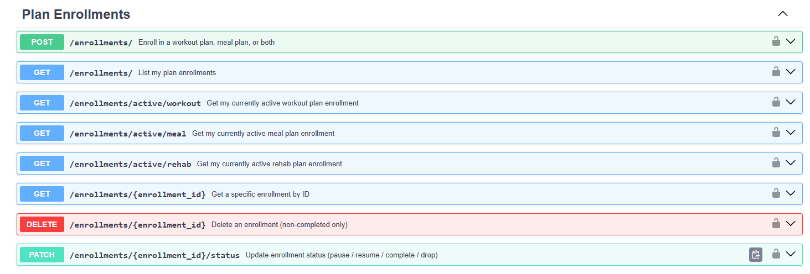


**Enrollment status lifecycle (forward-only):**
```
active → paused → active  (resumable)
       → dropped          (terminal)
       → completed        (terminal)
```

| Method | Endpoint | Auth | Rate Limit | Description |
|---|---|---|---|---|
| `POST` | `/enrollment/` | ✅ | 20/min | Enroll in one or more plans |
| `GET` | `/enrollment/` | ✅ | 30/min | List all enrollments (status filter) |
| `GET` | `/enrollment/active/workout` | ✅ | 30/min | Get active workout enrollment |
| `GET` | `/enrollment/active/rehab` | ✅ | 30/min | Get active rehab enrollment |
| `GET` | `/enrollment/{id}` | ✅ | 30/min | Get specific enrollment |
| `PATCH` | `/enrollment/{id}/status` | ✅ | 20/min | Update enrollment status |
| `DELETE` | `/enrollment/{id}` | ✅ | 10/min | Delete non-completed enrollment |

The `/active/workout` and `/active/rehab` endpoints are used by the frontend dashboard to determine which plan drives the user's current sessions.

---

### 9. Daily Logs — `/tracker/daily`

One daily summary log per user per calendar day. Tracks calories consumed, workouts completed, and recovery notes. Used for progress heatmaps and calendar views.

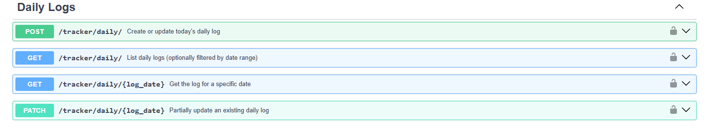

| Method | Endpoint | Auth | Rate Limit | Description |
|---|---|---|---|---|
| `POST` | `/tracker/daily/` | ✅ | 20/min | Upsert log for a date (idempotent) |
| `GET` | `/tracker/daily/` | ✅ | 30/min | List logs (`from_date` / `to_date` filter) |
| `GET` | `/tracker/daily/{date}` | ✅ | 30/min | Get log for a specific date |
| `PATCH` | `/tracker/daily/{date}` | ✅ | 20/min | Partial update existing log |

`POST` is an **upsert** — calling it multiple times with the same date is safe and only non-null fields are updated on existing records.

---

### 10. Rehab — `/rehab`

Rehabilitation library and plan management. Covers rehab conditions, rehab exercises, user condition assignment, and full CRUD for rehab plans, routines, and exercises.

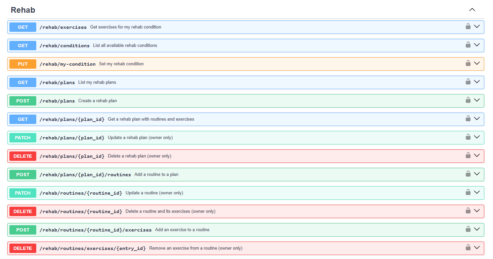

**Data hierarchy:**
```
RehabCondition  ←→  RehabExercise  (many-to-many via condition_mapping)

RehabPlan (per user)
  └── RehabRoutine (ordered)
        └── RehabRoutineExercise (sets, reps, hold_time, rest, notes)
```

| Method | Endpoint | Auth | Description |
|---|---|---|---|
| `GET` | `/rehab/conditions/` | ✅ | List all rehab conditions |
| `GET` | `/rehab/conditions/{id}` | ✅ | Get condition with associated exercises |
| `GET` | `/rehab/exercises/` | ✅ | List rehab exercises |
| `GET` | `/rehab/exercises/{id}` | ✅ | Get exercise detail |
| `POST` | `/rehab/user-condition` | ✅ | Set user's rehab condition |
| `GET` | `/rehab/user-condition` | ✅ | Get user's rehab condition |
| `GET` | `/rehab/plans/` | ✅ | List own rehab plans |
| `POST` | `/rehab/plans/` | ✅ | Create rehab plan |
| `GET` | `/rehab/plans/{id}` | ✅ | Get plan with routines and exercises |
| `PATCH` | `/rehab/plans/{id}` | ✅ | Update plan |
| `DELETE` | `/rehab/plans/{id}` | ✅ | Delete plan |
| `POST` | `/rehab/plans/{id}/routines` | ✅ | Add routine to plan |
| `PATCH` | `/rehab/routines/{id}` | ✅ | Update routine |
| `DELETE` | `/rehab/routines/{id}` | ✅ | Delete routine |
| `POST` | `/rehab/routines/{id}/exercises` | ✅ | Add exercise to routine |
| `DELETE` | `/rehab/routines/exercises/{id}` | ✅ | Remove exercise from routine |

---

### 11. Rehab Tracking — `/tracker/rehab`

Real-time rehabilitation session tracking with pain level monitoring. Sessions are tied to a rehab plan routine. Exercises are **auto-populated** from the routine prescription on session creation. Backed by stored procedures for analytics.

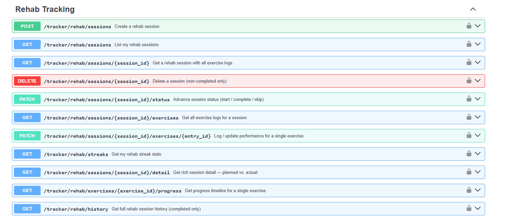

**Session status lifecycle (forward-only):**
```
scheduled → in_progress → completed  (terminal)
          → skipped                  (terminal)
```

| Method | Endpoint | Auth | Rate Limit | Description |
|---|---|---|---|---|
| `POST` | `/tracker/rehab/sessions/` | ✅ | 20/min | Create rehab session |
| `GET` | `/tracker/rehab/sessions/` | ✅ | 30/min | List sessions (status/date/plan filter) |
| `GET` | `/tracker/rehab/sessions/{id}` | ✅ | 30/min | Get session with exercise logs |
| `PATCH` | `/tracker/rehab/sessions/{id}/status` | ✅ | 20/min | Advance session status |
| `DELETE` | `/tracker/rehab/sessions/{id}` | ✅ | 10/min | Delete non-completed session |
| `GET` | `/tracker/rehab/sessions/{id}/exercises` | ✅ | 30/min | Get all exercise logs |
| `PATCH` | `/tracker/rehab/sessions/{id}/exercises/{entry_id}` | ✅ | 60/min | Log/update single exercise |
| `GET` | `/tracker/rehab/streaks` | ✅ | 30/min | Get rehab streak stats |
| `GET` | `/tracker/rehab/sessions/{id}/detail` | ✅ | 30/min | Planned vs actual detail |
| `GET` | `/tracker/rehab/exercises/{exercise_id}/progress` | ✅ | 30/min | Exercise progress timeline |
| `GET` | `/tracker/rehab/history` | ✅ | 20/min | Full completed session history |

**Analytics endpoints** (powered by PostgreSQL stored procedures):

| Endpoint | Stored Procedure | Returns |
|---|---|---|
| `GET /tracker/rehab/streaks` | `tracker.get_rehab_streaks` | `current_streak`, `longest_streak`, `last_active_day` |
| `GET /tracker/rehab/sessions/{id}/detail` | `tracker.get_rehab_session_detail` | Planned vs actual per exercise |
| `GET /tracker/rehab/exercises/{id}/progress` | `tracker.get_rehab_exercise_progress` | Chronological performance timeline |
| `GET /tracker/rehab/history` | `tracker.get_rehab_completed_sessions` | All completed sessions with breakdown |

**Business rules:**
- Routine exercises are **auto-populated as exercise logs** when a session is created.
- Exercise logs can only be updated while the session is `in_progress` (returns `409` otherwise).
- Completing a session requires at least 1 exercise marked `is_completed = true`.
- `pain_level` is validated in range **1–10** at the schema layer.

---

## Cross-Cutting Concerns

### Rate Limiting

All rate limits are applied per client IP address using `slowapi`. No Redis is required — limiting is in-process, suitable for single-process PaaS deployments (Render, Railway, etc.).

| Category | Limit |
|---|---|
| Registration / token refresh | 5/min |
| Login | 10/min |
| Read (GET) endpoints | 30/min |
| Write (POST/PATCH/DELETE) endpoints | 20/min |
| High-frequency exercise logging | 60/min |
| Admin endpoints | No explicit limit (protected by role check) |

### CORS

```
allow_origins=["*"]   # ⚠️ Restrict to your frontend domain in production
allow_credentials=True
allow_methods=["*"]
allow_headers=["*"]
```

### Authorization

| Guard | Mechanism | Used on |
|---|---|---|
| `get_current_user` | Validates JWT via Supabase, returns user | All protected endpoints |
| `require_admin` | Chains on `get_current_user` + DB role check | Library management endpoints |
| Ownership check | `user_id` from JWT matched against resource in DB | Plans, sessions, logs |

### Data Integrity Patterns

- **Forward-only state machines** on all session and enrollment statuses — enforced at the service layer.
- **Permanent terminal records** — completed/terminal records cannot be deleted (`409 Conflict`).
- **Upsert semantics** on daily logs — `POST /tracker/daily/` is idempotent per `user + date`.
- **Dual validation** — DB-level unique constraints backed by application-layer duplicate checks.
- **BMI computed by DB trigger** — never inserted from the application.

---

## Design Principles

1. **Module Isolation** — Each domain is fully self-contained (router / service / repository / model / schema).
2. **Dependency Injection** — FastAPI `Depends()` used for DB sessions, authentication, and rate limiting.
3. **Dual Database Access** — SQLAlchemy for all data queries; Supabase Python client used exclusively for Auth.
4. **No Migration Management from App** — All table creation and migration is handled by Supabase. SQLAlchemy is the read/write query layer only.
5. **Schema Namespacing** — PostgreSQL schemas (`profile`, `library`, `plans`, `tracker`) provide logical separation at the database level.
6. **Stored Procedures for Analytics** — Complex aggregations are offloaded to PostgreSQL for performance and atomicity.
7. **Lazy `selectin` Loading** — SQLAlchemy relationships avoid N+1 queries without explicit joins.
8. **Consistent Response Shapes** — List endpoints return `{total, results}`; detail endpoints return full nested objects.
9. **Rate Limiting Without Infrastructure** — `slowapi` provides per-IP limiting without requiring Redis.

---

## Background Worker

The `worker/` directory contains a Celery application configured for async background tasks. Currently minimal — intended for future use cases:

- Scheduled notifications
- Streak recalculation
- Plan expiry handling
- Report generation

---

*Legend: ✅ Authenticated user required &nbsp;|&nbsp; 🔑 Admin role required*
